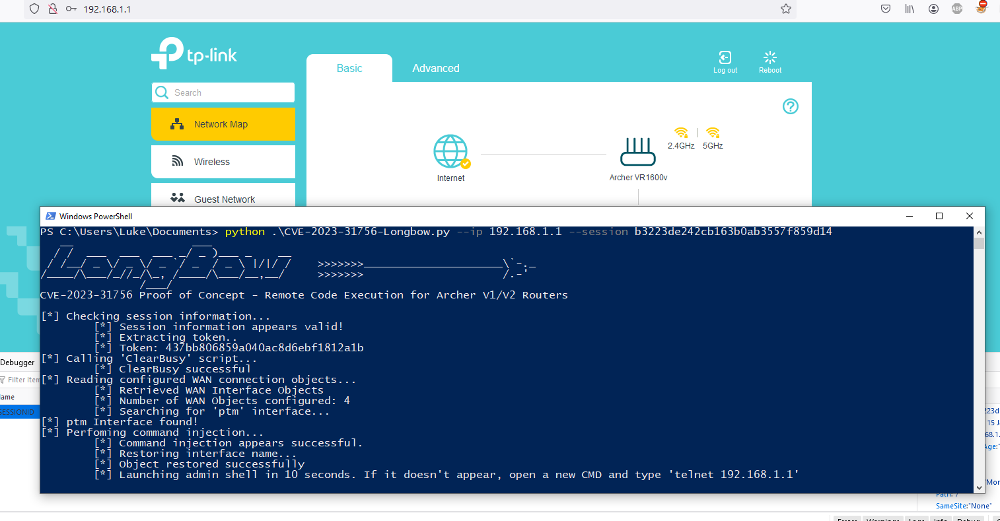

# Archer TP-Link Router Local Remote Command Execution Exploit (CVE-2023-31756)

## Overview

This Python script demonstrates a local remote command execution vulnerability within the Archer TP-Link VR1600V V1/V2 routers. The exploit allows for administrative-level operating system access on the router. With this access, you can re-enable OpenVPN server as well as disable CWMP and other Administrative tasks restricted from the Web Portal.

## Prerequisites

Before using this script, ensure you have the following prerequisites in place:

- Python 3.x installed on your system.
- "Admin" Access to an Archer TP-Link V1/V2 router. (Hint: default credentials are admin:admin)
- Proper authorization to test the vulnerability on the router.

## Usage

1. Clone this repository to your local machine:
```
git clone https://github.com/StanleyJobsonAU/LongBow.git
```
2. Navigate to the project directory:
```
cd LongBow
```
3. Browse via web browser to your Admin Web Portal (e.g. 192.168.1.1:80)
4. Login with default admin credentials
5. Once logged in, retrieve the "JSESSIONID" cookie (F12 -> Storage -> Cookies -> JSESSIONID) and note it down.
6. Run the script with the following syntax:

```
python CVE-2023-31756-LongBow.py --ip [IP of router] --session [JSESSIONID Cookie]
Example: python CVE-2023-31756-LongBow.py --ip 192.168.1.1 --session b3223de242cb163b0ab3557f859d14
```

7. If successful, a root level shell will be available on port 23. Use telnet to connect (e.g. telnet 192.168.1.1 23)

## Screenshots



## Exploit Details

This script takes advantage of a local remote command execution vulnerability in Archer TP-Link V1/V2 routers Web Interface. The vulnerability allows an attacker to gain administrative access to the router's operating system by binding an OS level shell to Telnet

## Disclaimer

This script is provided for educational and research purposes only. It is important to use this script responsibly and only on devices you are authorized to test. Unauthorized use of this script on networks or devices you do not own or have explicit permission to test may be illegal and unethical.

## License

This project is licensed under the MIT License - see the [LICENSE](LICENSE) file for details.
